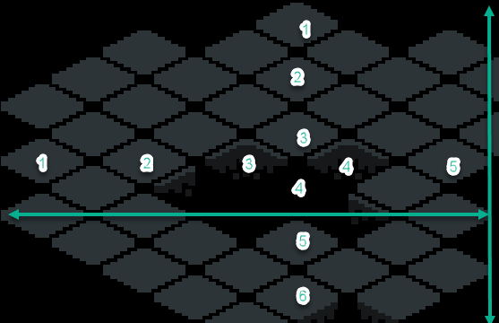

# Create a Tile Set

## Create an Isometric tile set

### What you need to know:

1. The size of the isometric tiles.

Get the height and width of the area of an individual cel of the tile set. 

* Height: This is from top corner to bottom corner of the tile.

* Width: This is from left corner to right corner of the tile.

The top corner of one tile always lines up with the bottom corner of the tile above it. The left corner of one tile always lines up with the right corner of the tile to the left of it.

Shown in the image is the measurement of a tile.

If you have an example of a whole floor of tiles, you can measure the height and width of the whole floor and divide it by the number of tiles in that row or column to get the size of an individual tile.

In the image above, you would measure the width and divide by 5 to get the width of an individual tile, and measure the height and divide by 6 to get the height of an individual tile.

1. The texture region you need to fit the content you want to have in each tile.

You can determine the max top, bottom, left, and right area you need around the tiles themselves to be available for the content you want to have in each tile.

For a tyle that covers more area than the tile itself, parts of the tile will spill over onto other tiles. This is fine, as long as you are aware of it and design the tiles accordingly.

For example, you may have a tree that takes 1 tile, but the top of the tree will spill over to the top, left, and right.

Shown in the image is the texture region of a tile.

## Typical Isometric Tile Sizes

The width of an isometric tile is typically 2x the height. This is what simulates the isometric perspective.

| Tile Size simulated | Actual Width | Actual Height |
|-----------|-------|--------|
| 32x32     | 32    | 16     |
| 64x64     | 64    | 32     |

### Correct the texture origin in Godot

Use the texture origin field to align the tile with the correct location on the texture region.

