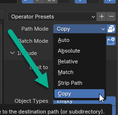

# Blender Mixamo Godot Pipeline

- Create a 3D model in Blender
- Export the model as an FBX file
  - When exporting, select "copy" and "embed textures"

- [See a helpful video on how to export fbx with textures](https://www.youtube.com/watch?v=59BRBCNd8Gg&ab_channel=Olav3DTutorials)
- 