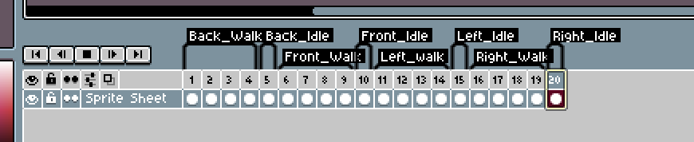
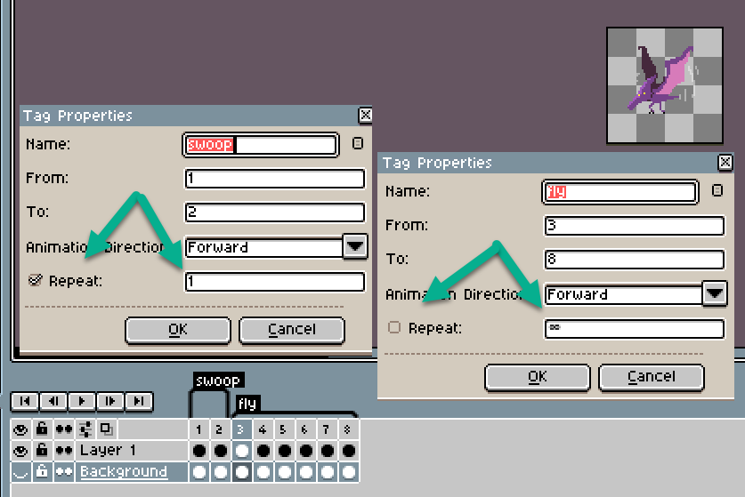

# Creating Animations in Aseprite

## Who is this for

- Any artist using Aseprite to create animations for a Godot game.
- Any programmer working in Godot who needs to understand how to work with animations created in Aseprite.

## Purpose

The purpose of this guide is to help you understand the standards and procedures for creating animations in Aseprite for Godot.

## Tools

- [Aseprite](https://www.aseprite.org/)
- [Godot](https://godotengine.org/)
- [Aseprite Wizard](https://godotengine.org/asset-library/asset/713)

## Why Aseprite Wizard?

- Aseprite Wizard is a plugin for Aseprite that exports animations to Godot.
- It exports animations to a `.tres` file.
- It does not require all contributors to have Aseprite installed.
- AnimatedSprite nodes can be configured in Godot with Aseprite settings so that a contributor can reimport edited Aseprite files for faster iteration.

## Identify different animations with tags

### Why?

By identifying regions with tags, you communicate to the importer in Godot how to handle the animations.

An example showing multiple regions tagged in Aseprite.

Note: Prefer using the following format for tags:

- all lowercase
- underscores instead of spaces
- animation_direction eg. `idle_front`, `run_left`

## Mark animations that do not loop

Looping is teh default behavior for a region. If you have an animation that does not loop, you can mark it with:

`[x] repeat: 1`

Example animations that do not loop:

- jump
- death

