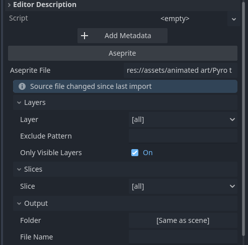

# Importing Aseprite Animations in Godot

## Who is this for

- Any person importing animations created in Aseprite into Godot.

## Tools

- [Aseprite](https://www.aseprite.org/)
- [Godot](https://godotengine.org/)
- [Aseprite Wizard](https://godotengine.org/asset-library/asset/713)

## Install Aseprite Wizard

1. Download the [Aseprite Wizard](https://godotengine.org/asset-library/asset/713) plugin.

## Importing animations

1. Open your Godot project.
2. Drag and drop the `.aseprite` file into the Godot file system.

## Prepare an AnimatedSprite2D

1. Create a new scene.
2. Add an `AnimatedSprite2D` node.

3. Open the inspector panel.
4. At the bottom, under `Aseprite`, select the `.aseprite` file you imported. (You can drag and drop the file into the `Aseprite File` field.)

5. Click the `Import` button.

## Reimporting after the Aseprite file has been updated

1. Open the `AnimatedSprite2D` node.
2. At the bottom, under `Aseprite`, click the `Reimport` button.
