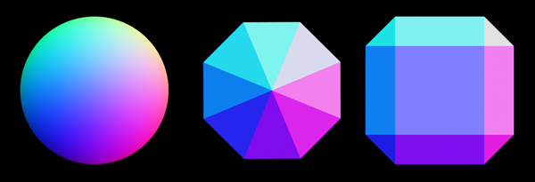

# Example Reference Normal Maps

You can use these images as a reference for creating your own normal maps. They are not meant to be used directly in your projects, but rather to help you understand how normal maps can be created and applied.

[text](images.jfif)

