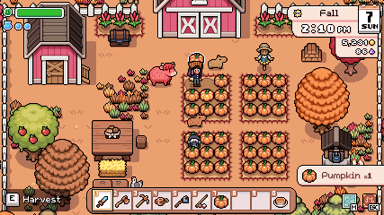

# Pixel Art Guide

## Specifications

### Sprite Sheets

Prefer to use Aseprite for creating sprite sheets. If so, follow [this guide](../creating-animations-in-aseprite.md) instead.

- Always have 1px border around the largest content in the sprite sheet.
  - The game engine can crop the sprite sheet to remove the border.
  - This prevents the sprite from bleeding into other sprites in engine.
- Decide the relative character height to screen height ratio.
  - Example: Character is 1/8 screen height
- Decide the number of pixels the character will be tall using typical size range:
  - From approx 8px tall to approx 256px tall. Common approximate sizes are 16px, 32px, 64px
- Calculate the pixel art game world resolution needed based on character size.
  - Example: 16px tall character where you want character to be 1/8 canvas height, then canvas height would be 128px.
- Calculate in-game scale factor integer to scale up the game to match a typical canvas size for pixel art.
- Typical canvas sizes for pixel art are:
  - 320x180
  - 640x360
  - 1280x720
- NOTE: A very common Configuration would be 320x180 with up to 6x scaling.
- Decide the character head: body ratio based on style and character features, heroic, chibi, cute, etc.
  - Example: Head is 1/3 of body height for cartoonish look.
- Determine frame rate (default to 10fps)
- Decide character speed in how long it takes to move accross the screen.
  - Calculate character movement speed in pixels per second.
  - Calculate the character stride length in

[A tool to help decide on specs](https://www.screwloosegames.com/pixel-art-tool)

Example

427 x 240 canvas size

### Handling scaling and stretching in Godot engine as a programmer

Notes from the engine documentation:

Pixel art:

Set the base window size to the viewport size you intend to use. Most pixel art games use viewport sizes between 256×224 and 640×480. 640×360 is a good baseline, as it scales to 1280×720, 1920×1080, 2560×1440, and 3840×2160 without any black bars when using integer scaling. Higher viewport sizes will require using higher resolution artwork, unless you intend to show more of the game world at a given time.

Set the stretch mode to `viewport` if the game is intended to be 100% pixel art including all UI and the UI resolution and the game world sprites will all be 1:1. If even the UI art is intended to scale to a higher pixel density, set the stretch mode to `canvas_items`.

Set the stretch aspect to keep to enforce a single aspect ratio (with black bars). As an alternative, you can set the stretch aspect to expand to support multiple aspect ratios.

If using the expand stretch aspect, Configure Control nodes' anchors to snap to the correct corners using the Layout menu.

Set the stretch scale mode to `integer`. This prevents uneven pixel scaling from occurring, which makes pixel art not display as intended.

You can set this in the Godot project settings.
`rendering/2d/snap/snap_2d_transforms_to_pixel`
`rendering/2d/snap/snap_2d_vertices_to_pixel`

