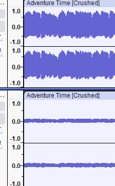
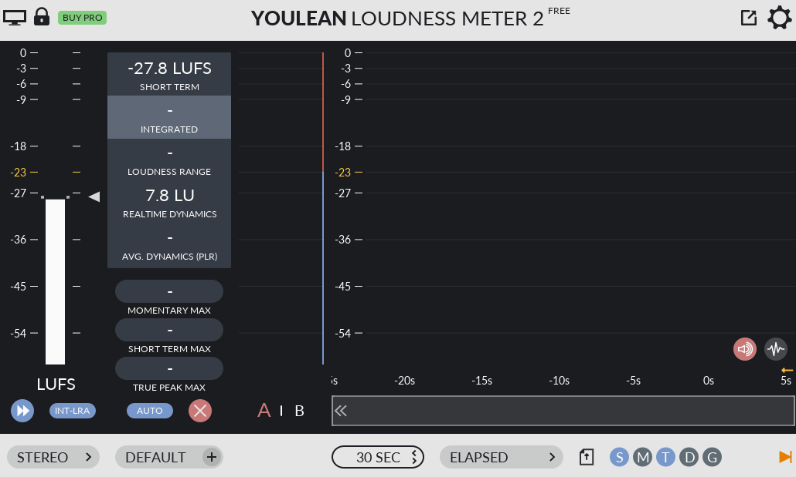
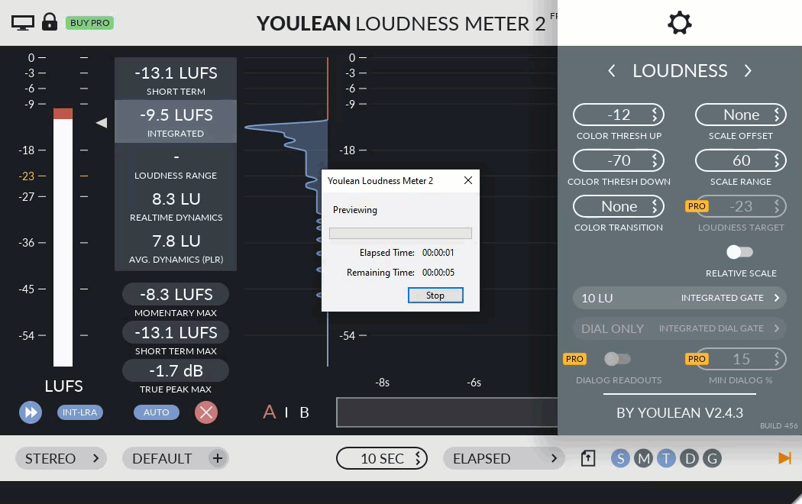
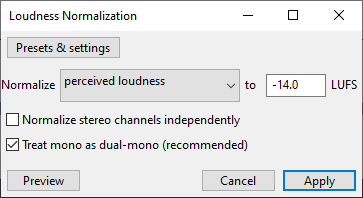
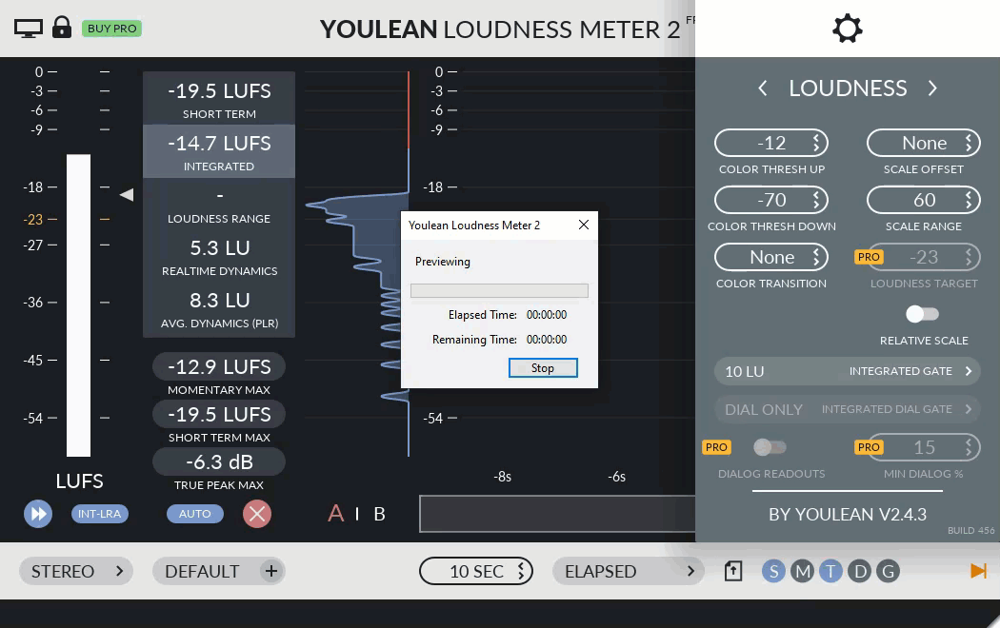
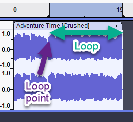
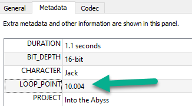
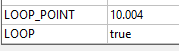

# How to Contribute Music

This document covers the specifications for music in the game. If you are interested in contributing music, please read this document carefully.

## See also

- [How to contribute sound effects](./how_to_contribute_sound_effects.md)
- [How to contribute voice-over](./how_to_contribute_voice_over.md)
- [How to contribute ambient sounds](./how_to_contribute_ambient_sounds.md)

## Overview

This document provides detailed guidelines for music composers contributing to projects. To ensure consistency and seamless integration with our Godot 4 games, please adhere to the following specifications for music submission.

## Music Specifications

### File Format

`.ogg` OGG (Ogg Vorbis)

### Bitrate

192 kbps Constant Bitrate (CBR)

### Reasoning

OGG provides an excellent balance between quality and file size, and 192 kbps ensures high-fidelity audio.

---

### **Audio Processing**

- **Normalization**: All music files must be normalized to ensure consistent playback volume across different tracks. Please apply a **-1 dB ceiling** to prevent clipping during playback.
  - **Target loudness**: -14 LUFS (for a balance between loudness and dynamics).
  - **Ensure no excessive dynamic range compression**, unless stylistically required.

Example visual difference in loudness levels:

#### LUFS (Loudness Units Full Scale)

- LUFS is a standard measurement for loudness in audio. It helps maintain consistent volume levels across different tracks.
- For original music, aim for a target loudness of -14 LUFS. You want it loud in the original recording to keep the dynamics, but not too loud that it clips or distorts. You need some headroom for mastering.
- Music will be adjusted (likely brought down to about -24 LUFS) to match the target loudness in the game engine.

##### Example LUFS meters

Example tool: [Youlean Loudness Meter](https://youlean.co/youlean-loudness-meter/)

Too quiet:

A little too loud:

##### Apply LUFS normalization

After normalization:

### **Looping Music**

- For looping tracks, ensure the loop is seamless and doesn’t include any audible pops or clicks.
- Avoid fade-in or fade-out on loops unless specifically requested.
- If possible, provide two versions:
  1. **Looping Version**: For in-game looping (ensure seamless playback).
  2. **Full Version**: For promotional purposes or non-looped segments.

### **Store loop data in metadata**

Given you have a file where the end of the file is designed to loop seamlessly back into an earlier part of the file:

Set `LOOP_POINT` in the metadata to the point in seconds where the loop should start:

Example metadata with `LOOP_POINT` set to a value in seconds (with precision up to 0.001):

Also, set LOOP to true:

- Put `_loop` at the end of the file name (e.g., `main_theme_loop_v4.ogg`).

### **Sample Rate and Bit Depth**

- **Sample Rate**: 44.1 kHz (standard for game music)
- **Bit Depth**: 16-bit (sufficient for game audio quality while keeping file sizes manageable)

### **File Naming Conventions**

- Use this format to name files:
  - **[project_name]_bgm_[description]_[version].ogg**
  - Example: `puzzlegame_bgm_main_theme_v1.ogg`
- Be descriptive with the track’s purpose (e.g., "main_theme," "boss_fight," "ambient_loop").
- Use underscores to separate words (e.g., `main_theme.ogg`, `boss_fight.ogg`).
- Use lowercase letters
- Avoid special characters or spaces in file names.
- Use version numbers for different iterations (e.g., `main_theme_v1.ogg`, `main_theme_v2.ogg`).
- If the file loops, put `_loop` at the end of the file name (e.g., `main_theme_loop_v4.ogg`).

### **Metadata Requirements**

Include the following metadata in the OGG files:

- Track title
- Composer name
- Track length
- Any specific instructions for use (e.g., specific in-game context, scene details)

### **Submission Guidelines**

1. **Review and Submission Process**
   - All tracks must be submitted for review via the project’s designated shared drive or repository.
   - Ensure files are properly named and organized in a "Music" folder under the project name.

2. **Delivery Format**
   - Use the project’s shared file storage or GitHub repository for file delivery.
   - Ensure tracks are compressed efficiently to minimize file size without sacrificing quality (192 kbps OGG).
   - Organize files into a "Music" folder within the project’s audio directory. `/project/assets/audio/music`.
