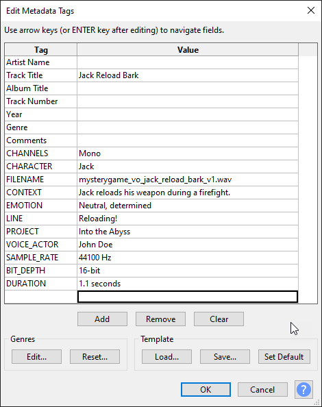

# Voice-Over Contribution Guidelines

## Overview

This document provides guidelines for voice-over artists contributing to projects. By following these specifications, you can ensure that your voice-over work is compatible with our game development process and integrates smoothly into our games. We use different file formats for dialog and barks to balance quality, performance, and file size, which are critical in game development.

---

## Definitions

- **Dialog**:
  - Any **longer spoken lines** or conversations between characters in the game. This includes cutscenes, scripted events, or any part of the story delivered through voice-over. Dialog is typically streamed during gameplay.
  
- **Barks**:
  - **Short, reactive voice lines** delivered during gameplay. Barks are often triggered by player actions or events (e.g., "Reloading!", "Watch out!", or "Enemy spotted!"). They are designed to give quick feedback or information.
  - **Max Length**: **2-3 seconds** (Barks should be brief to maintain gameplay flow and avoid overwhelming the player.)

---

## File Format and Quality Specifications

### 1. Dialog Files

- **Format**: OGG (Ogg Vorbis)
- **Bitrate**: 192 kbps minimum
- **Why OGG?**:
  - OGG provides a **compressed** file format with **high-quality audio** and smaller file sizes, which is ideal for dialog. Since dialog can be long and may involve several lines of conversation, using OGG ensures that we maintain good sound quality while keeping the file sizes manageable for performance and storage.
- **Normalization**: Dialog should be **normalized** to ensure consistent playback volume. Apply a **-1 dB ceiling** to prevent clipping.
- **Sample Rate**: 44.1 kHz
- **Bit Depth**: 16-bit
- **Channels**: Stereo for most dialog; Mono if spatialization is required.

### 2. Bark Files

- **Format**: WAV (Waveform Audio File Format)
- **Bit Depth**: 16-bit or 24-bit
- **Sample Rate**: 44.1 kHz
- **Why WAV?**:
  - **WAV is uncompressed**, meaning it plays back **instantly** without any need for the game engine to decode the file. This is important for short, reactive barks that need to play immediately in response to player actions. The higher quality ensures the barks are clear and impactful.
- **Max Length**: **2-3 seconds**
- **Normalization**: Ensure that barks are normalized for consistent volume levels. Set a ceiling at **-1 dB** to avoid clipping.
- **Channels**: Mono is preferred for barks, especially when spatialized audio is needed, allowing the game engine to position the sound based on player location.

---

## Recording Guidelines

- **Quiet Recording Environment**: Ensure your recordings are made in a **soundproof or treated environment** to avoid any background noise or echo.
- **Mic Quality**: Use a **high-quality condenser microphone**. This helps to capture a full, rich sound, which is important for both dialog and barks.
  
---

## Submission Guidelines

1. **Review and Submission Process**:
   - All voice-over files should be submitted to our designated shared drive or GitHub repository.
   - Files must follow the naming convention and be organized into folders by asset type (e.g., "Dialog" and "Barks").

2. **Metadata**:
   - We encourage you to include relevant metadata in your files, such as the character name, scene, or purpose of the line. Use ID3 metadata format

3. **Versioning**:
   - If you make updates or changes to a file, ensure to version the file name clearly (e.g., `v2`, `v3`).

4. **File Naming Convention**:
   - Use the following format for naming files:  
    **[project_name]_vo_[character_name]_[line_description]_[version].extension**
   - Example: `mysterygame_vo_jack_angry_response_v1.ogg` for dialog or `mysterygame_vo_jack_reload_bark_v1.wav` for barks.
  
---

## Why metadata matters

While metadata is not a hard requirement in many cases, it's important to understand why it matters.

Metadata is important because it provides context and information about the voice-over files. This information helps the development team understand the content, context, and purpose of each line, making it easier to integrate the voice-over into the game. Here's a breakdown of the metadata fields:

- **Character Name**: Specifies the character delivering the line.
- **Scene/Context**: Provides information about where the line is used in the game.
- **Line**: The actual spoken line for reference.
- **Voice Actor**: Useful for crediting the voice-over artist or getting a re-take.
- **Context**: Describes the situation or context in which the line is spoken. Helps the voice actor understand the emotional tone or urgency required. Helps the team understand the context of the line once recorded.
- **Emotion**: Describes the emotional tone of the line (e.g., happy, sad, angry). Useful for choosing the right take or creating a  dynamic gameplay experience.
- **intensity**: (float 0-1) Specifies the emotional intensity of the line. Useful for choosing takes or making dynamic voice over in game dependant upon the situation.
- **Version**: Useful for tracking changes and updates to the file.

## Example Metadata

## Minimum Metadata Fields

- **Character Name**: Jack
- **Scene/Context**: Reload Bark
- **Line**: "Reloading!"
- **Voice Actor**: John Doe

## Why File Formats Matter

- **Dialog in OGG**: The **compressed size** of OGG is essential for **longer conversations** and cutscenes, helping to reduce the game’s overall size and memory footprint. The **192 kbps bitrate** ensures the audio remains clear and detailed without excessive compression artifacts.
  
- **Barks in WAV**: WAV files ensure **instant playback**, which is crucial for short, reactive sounds like barks that need to be played as soon as a player triggers them. Because they are typically less than 3 seconds long, the larger file size of WAV is not a concern.

---

By following these specifications, your voice-over work will be integrated seamlessly into our games, ensuring both quality and performance across different audio types.
