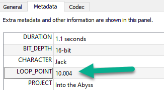
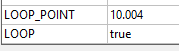

# How to Make Looping Audio Tracks

## Overview

This guide provides information on how to create looping audio tracks for games. It is specifically focussed on the technical specifications of the final files and not a specific process for a specific tool.

### **Looping Music**

- For looping tracks, ensure the loop is seamless and doesn’t include any audible pops or clicks.
- Avoid fade-in or fade-out on loops unless specifically requested.
- If possible, provide two versions:
  1. **Looping Version**: For in-game looping (ensure seamless playback).
  2. **Full Version**: For promotional purposes or non-looped segments.

### **Store loop data in metadata**

Given you have a file where the end of the file is designed to loop seamlessly back into an earlier part of the file:

Set `LOOP_POINT` in the metadata to the point in seconds where the loop should start:

Example metadata with `LOOP_POINT` set to a value in seconds (with precision up to 0.001):

Also, set LOOP to true:

- Put `_loop` at the end of the file name (e.g., `main_theme_loop_v4.ogg`).

## See Also

- [Making Audio Loops in Audacity](https://support.audacityteam.org/music/working-with-audio-loops/making-audio-loops)
