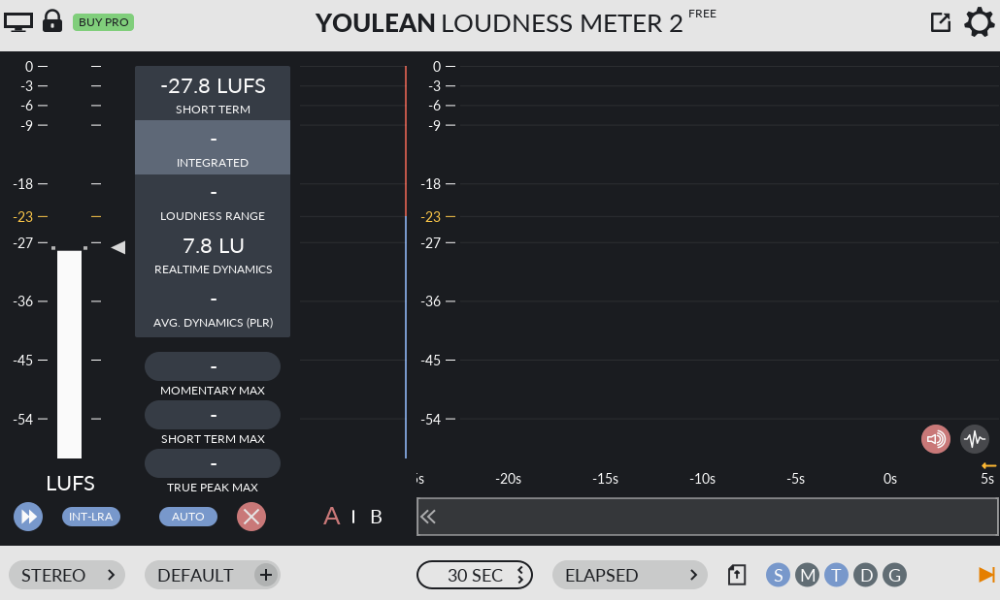
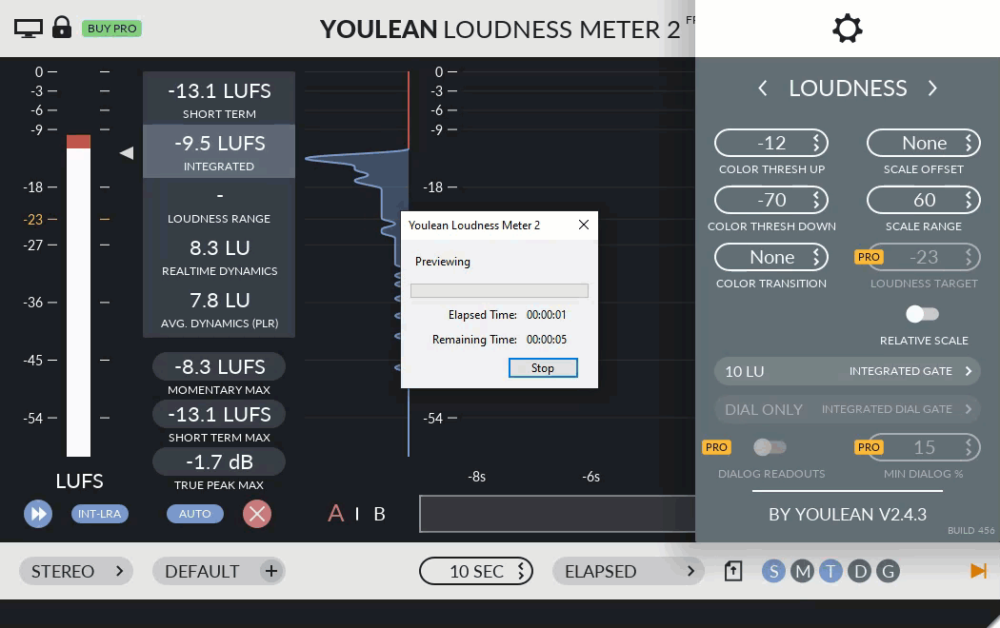
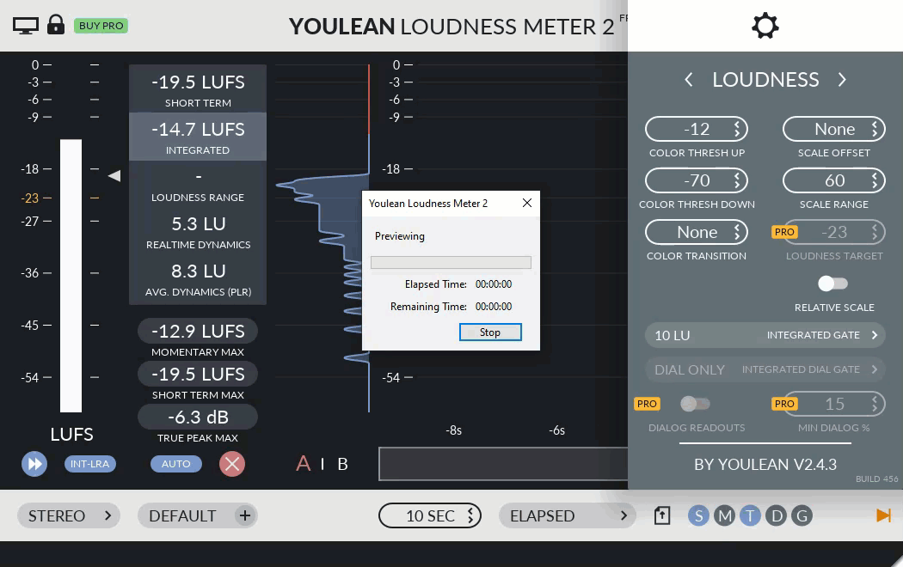

# How to Normalize Audio to LUFS

## What is LUFS?

LUFS stands for Loudness Units Full Scale. It is a standard measurement for loudness in audio. It helps maintain consistent volume levels across different tracks.

Example visual difference in loudness levels:

- For original music, aim for a target loudness of -14 LUFS. You want it loud in the original recording to keep the dynamics, but not too loud that it clips or distorts. You need some headroom for mastering.
- Music will be adjusted (likely brought down to about -24 LUFS) to match the target loudness in the game engine.

### Example LUFS meters

Example tool: [Youlean Loudness Meter](https://youlean.co/youlean-loudness-meter/)

Too quiet:

A little too loud:

### Apply LUFS normalization

After normalization:

