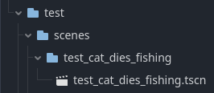
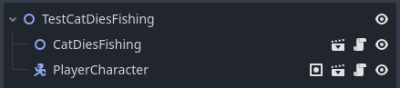

# Contributing Godot Scenes

## Create a test scene in test/scenes/test_\<your_scene_name\>/test_\<your_scene_name\>.tscn

Your scene path: project/locations/outside/outside.tscn
Test scene path: test/scenes/test_outside/test_outside.tscn

Example:

```text
- test/
  - scenes/
    - test_cat_dies_fishing/
      - test_cat_dies_fishing.tscn
```



## Test Scene contents

### Purpose

The purpose of a test scene is to create an isolated environment to create and functionally test a new component of the game. Creating and testing the scene here first before integrating it into the rest of the game helps reduce the chances of conflicts that occur when multiple people are working on the same scene.

The additional benefit is that the scene can be tested quickly and repeatedly without the need to create special temporary changes to an existing scene in the game.

### When adding new changes to an existing scene

When adding new changes to an existing scene, still create the test scene first. This will allow you to test the new changes in isolation before integrating them into the existing scene.

Look for opportunities to encapsulate the work you are contributing into its own scene. Add that scene to a test scene.

Q: What if my work is intended to replace work in an existing scene?

Still create the test scene first. This will allow you to test the new changes in isolation before integrating them into the existing scene. Once you are done, make a commit. Pull in any changes that have been made in the remote repo.

`git pull -r origin main`

Now incorporate those changes into the existing scene. This work should occur relatively quickly and by potentially by simply copy-pasting.

Make a new commit with your changes.

incorporate any changes that have been added on the remote repo since your last rebase.

`git pull -r origin main`

Make your PR.

### Example Test Scene

The contents should be relatively simple and self-contained. It should test a specific feature or behavior of the game.



---

Written by [Jonathan Lewis](https://www.linkedin.com/in/jonathan-david-lewis/)

Please reach out if you have any questions or suggestions for improvements.