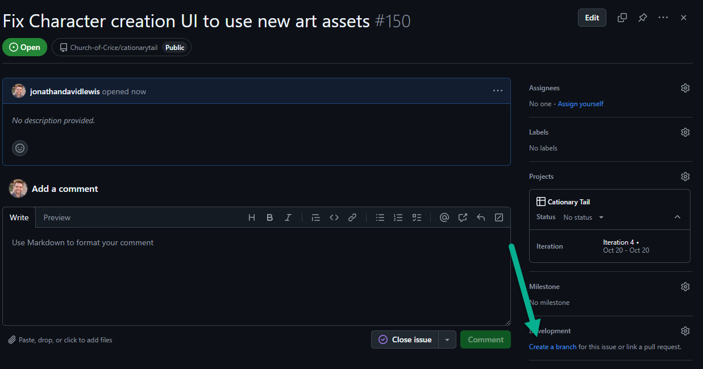
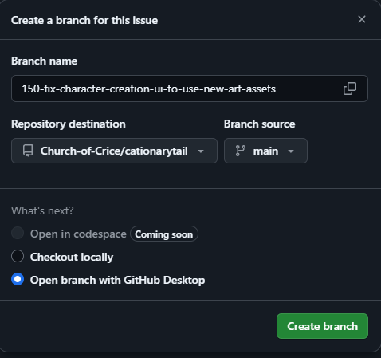

# Contribution Guide

## Purpose

The purpose of this guide is to help you understand the standards and procedures for contributing to the project.
These standards are intended to make it clear to you how to contribute in a way that is consistent with expectations.
By creating these standards, we make it possible for a group of people to collaborate and contribute with a minimum of confusion and friction.
By following these standards, you can increase the speed at which you can contribute work to the project.

## Process overview

- [Contribution Guide](#contribution-guide)
  - [Purpose](#purpose)
  - [Process overview](#process-overview)
  - [Create an issue](#create-an-issue)
  - [Assign yourself to an issue](#assign-yourself-to-an-issue)
  - [Create the branch from the GitHub GUI](#create-the-branch-from-the-github-gui)
  - [Make your contribution](#make-your-contribution)
    - [Contributing scenes](#contributing-scenes)
    - [Contributing Art](#contributing-art)
  - [Create a pull request](#create-a-pull-request)
  - [Review the pull request](#review-the-pull-request)
  - [Merge the pull request](#merge-the-pull-request)
  - [General guidelines](#general-guidelines)
  - [Code of Conduct](#code-of-conduct)
  - [Questions?](#questions)

## Create an issue

## Assign yourself to an issue

## Create the branch from the GitHub GUI

On the issue in GitHub, click the "create a branch" link on the bottom right.

If you are using command line, choose "checkout locally".
If you are using GitHub Desktop, choose "open with GitHub Desktop".

## Make your contribution

Write clean code, add tests if needed, update documentation, and test your changes locally.

### Contributing scenes

[Contributing Scenes](./contributing_godot_scenes.md) for contributing scenes.

### Contributing Art

- **Pixel Art**: Follow the guide [Contributing Pixel Art](contributing_pixel_art.md) for contributing pixel art.
- **Vector Art**: TBA
- **3D Art**: TBA

## Create a pull request

Push your branch and create a pull request with a descriptive title and summary of changes.

## Review the pull request

The pull request will be reviewed by peers or maintainers to ensure quality.

## Merge the pull request

Once approved, merge the pull request and delete the branch if applicable.

## General guidelines

- **Commit messages**: Use concise and descriptive messages.
- **Code style**: Follow the repository's code style guidelines.
- **Communication**: Ask questions if unsure about anything.

## Code of Conduct

Review and adhere to the project's Code of Conduct to maintain an open and welcoming environment.

## Questions?

Reach out via the project's communication channels if you have questions.
