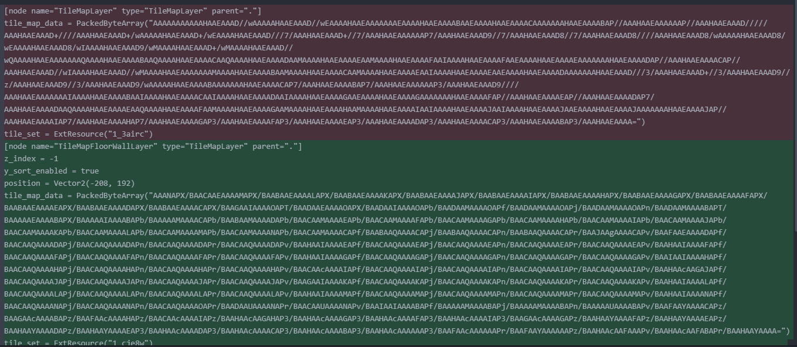
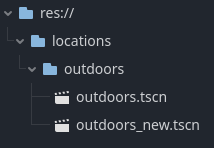
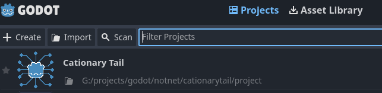
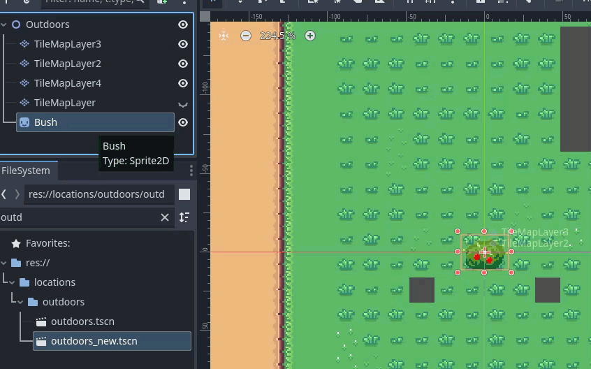
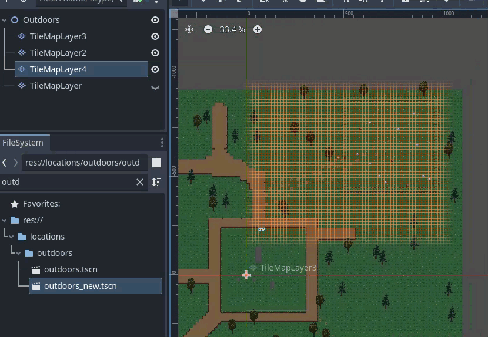

# Handling Merge Conflicts

## Handling merge conflicts in Scene Files (.tscn)

.tscn files are text files, so conflicts will show up in a merge conflict resolution tool. The tool will allow you to resolve the conflict as TEXT.

<span style="color: red;">Do not attempt to resolve the conflict by editing the .tscn file directly. It is "possible" to do so, but it is very common to make mistakes and introduce bugs into the scene file that make it totally unusable or overwrite changes that were made by other developers.</span>



These .tscn files are generated as the result of working in the Godot GUI. Use the Godot GUI to resolve the conflict.

### How to resolve a conflict in a .tscn file

When you see this kind of conflict in the merge tool. Create a file with a new name based on your version of the file. You can use the following command.

```text
git show :project/locations/outdoors/outdoors.tscn > project/locations/outdoors/outdoors_new.tscn
```

Replace the file name with your own file names (place the new file in the same directory).



Open the file in the Godot GUI and resolve the conflict by integrating your changes from your new version of the file into the old file.

Note: It is possible to open your NEW file in one godot instance and the OLD file in another godot instance. You can do this to view and explore the differences between the two files.

1. Open "their" version of the scene in godot.
2. Open a new Godot instance.
3. In the project select screen, open the same project in the new Godot instance.

4. Open the conflicting version of the scene in the new Godot instance.

### Copy changes from your scene into the old scene

In the first Godot instance (with the old version of the scene), copy the changes from your new scene into the old scene.
In the first godot instance, change between the two scenes to copy nodes and properties.

__NOTE: Only use the second Godot instance to view the differences between the two scenes.__

Example copying a node from the new scene to the old scene:



Example copying tile data from the new scene to the old scene:



Use this command to see the text differences between the two files.
This can help identify more subtle things such as properties that were changed.

```text
git diff project/locations/outdoors/outdoors.tscn project/locations/outdoors/outdoors_new.tscn
```

Run the scene and ensure that all of your changes were incorporated into the old scene.

### Add the resolved conflict and continue the rebase

After you have resolved the conflict, commit the resolved conflict.

```text
git add project/locations/outdoors/outdoors.tscn
git rebase --continue
```
