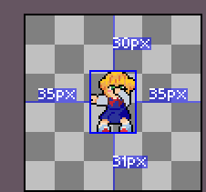
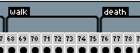
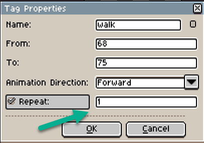

# Standard Practices

For game Jams approximately 4 days - 2 weeks.

## Purpose

The purpose of this document is to provide a set of standard practices for the development of games in collaboration with Screwloose Games. First and foremost, they are intended to give you as a contributor an environment that is predictable and consistent and help disambiguate expectations of you and of the team as a whole.

If this is your first time contributing, there's no need to memorize all of this. Just be aware that these practices exist and refer back to them as needed. If you have any questions, feel free to ask in the Discord.

You may be referred back to this document. This is simply a standard practice to reduce the need to reiterate and surface any shortcomings in these practices that should be addressed.

As we work together, we will learn from each other and improve these practices. If you have any suggestions, please let us know.

## Where do these come from?

These practices are a distillation of the experiences of the team members. They are not meant to be prescriptive, but rather a guide to help you navigate the project. They are a living document and will change as we learn and grow together.

At the end of each project, we reflect on our experience and update these practices to reflect what we have learned. We also update them as we learn from other sources.

## Self Care

We are all volunteers. We come together to make something we are proud of, something we can share with the world, and something that we couldn't make on our own. We are here to learn, to grow, and to have fun.

It can be easy to get caught up in the excitement of a project and lose sight of the bigger picture. Remember that we are all here to help each other. Prioritize your wellbeing. If you are feeling overwhelmed, take a break.

As much as you are able, communicate with the team. We are here to support you.

## Contact

- At any time, feel free to contact the team on Discord. @JonnyDPhoto, <https://discord.gg/465pbuvB>

## Game Engine

- Standard: Godot
- Possible:
  - Unity
  - Unreal Engine

Any other engine would be atypical and would require a discussion with the team.

## Contributing

- Each contributor works in their own branch (or puts features in a unique branch.)

  - Feature specific branches are expected only for long-term projects. (But feel free to use them if you want.)

- Work is typically brought into the main branch through PR. (With few exceptions)

## Art

### Pixel Art

#### Aseprite

- Animations should have 1 character / asset per file.

- Create a tag for each Animation.

- Set the tag to repeat: 1 for one-shot animations like 'death' (loop is default)

- Include the Aseprite file in the project. This allows for easy editing and exporting with in-engine tools such as: <https://github.com/viniciusgerevini/godot-aseprite-wizard>

## Code

### Code Style

- Use Spaces instead of tabs. (Tabs take up lots of space on github, impairing readability and genuinely making code review difficult at times.)

### Signals

- Attach signals in code only. (Using the signal editor adds another place to look for signal connections.)

### Tests

- Create a test scene for each new feature. (This will help with regression testing.)
  - An easy way to do this is to copy a game scene and strip it to the minimum to test the feature.
  - Name the scene `test_<feature_name>.tscn`

### Godot-tools extension

- Use the Godot-tools extension for VSCode. (It's a great tool for autocompletion and debugging.)
- Organize your code so as to minimize errors and warnings in Godot-tools.
- Raise any issues you notice with the extension.
