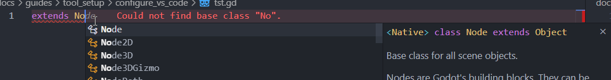
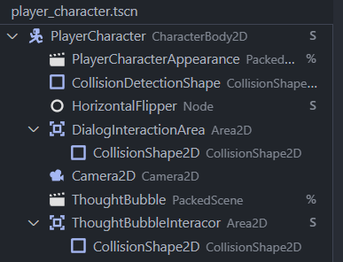
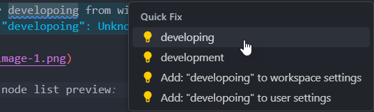

# Install VS Code Extensions

Extensions:

## Godot tools

[Marketplace link](https://marketplace.visualstudio.com/items?itemName=geequlim.godot-tools)

Godot tools gives you some better visibility into scene files and the ability to run the Godot scenes from within VS Code.

If you prefer developing from within VS Code, it adds syntax highlighting and autocompletion for GDScript.

Scene tree / node list preview

## Code SPell Checker (cspell)

[Marketplace link](https://marketplace.visualstudio.com/items?itemName=streetsidesoftware.code-spell-checker)

---

Written by [Jonathan Lewis](https://www.linkedin.com/in/jonathan-david-lewis/)

Please reach out if you have any questions or suggestions for improvements.